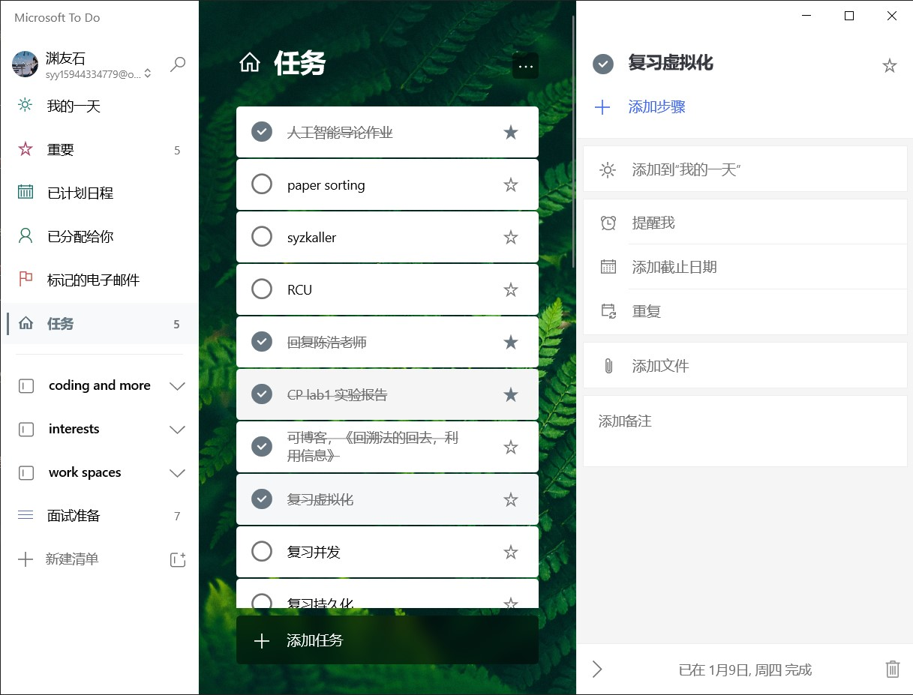

# 在Win10下构建轻量的编码环境

## 终端

使用windows terminal，可以直接在windows store中下载pre版本，不需要为此单独下载VS。

[终端配置](./terminal.md)

## Linux

下载并安装好wsl(windows subsystem for linux)，我选择的是Ubuntu 18.04 LTS。

### Vim

在wsl中，无可奈何的要使用一些终端编辑。我个人在这个时候是使用vim的。至于Emcas，或者SpaceEmcas、SpaceVim、nano等我是没有去使用，反正是辅助的一个使用，主要用VScode我推荐使用Vim。

[Vim配置](./vimsetting.md)

### zsh

为了方便和美观，我直接用zsh替换了一开始默认的bash。这样日常使用有一些好用的终端工具，赏心悦目。

[zsh配置](./zshsetting.md)

为了更好的使用终端，有一个[命令行的艺术](https://github.com/jlevy/the-art-of-command-line/blob/master/README-zh.md)推荐大家阅读

### 图形界面

这里使用的[Xming](https://sourceforge.net/projects/xming/)，把这个设置为windows自启比较好，省的每次都要打开。虽然其实用图形界面比较少。然后在`~/.zshrc`文件中加入一行

## 编辑器和写代码技巧

我是用的VScode，因为有着强大的插件库，和Remote SSH的功能直接打开本地WSL中的文件夹。

个人很喜欢剧中模式，因为代码其实相对每行不可能写很长，过长要考虑自己的问题了，或者分行。

不喜欢用下面的终端，因为太麻烦了。还是用terminal多一点。

[VScode个性化设置](./VScode_setting.md)

## 一切常用其他软件

### 读书 (BookXnote)

这个也是国内目前非开源，但是暂时也非商用的PDF阅读工具。他们的读书群真的很友好。[官网链接](http://www.bookxnote.com/)

### TODO List(Microsoft TO DO)

每次被打断，或者是无可奈何要停止手头工作的时候可以先写一个TODO list，如果是在写代码，直接用VScode的TODO Highlight插件让TODO高亮即可。

但是如果是别的事情需要一个软件，windows用户我就推荐window的TODO list。

十分整洁也没有广告。

### 为了保护眼睛(Project Eye)

我下载了一个在GitHub上开源的软件[Project Eye](https://github.com/Planshit/ProjectEye),我还给他提过issue反馈十分快，作者真的很积极的维护这个项目。

当然有时候浸入式写代码会无限期的忽略他的提示，还会强制关掉。但是为了健康还是要提示自己保护视力。

