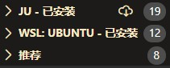
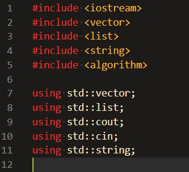
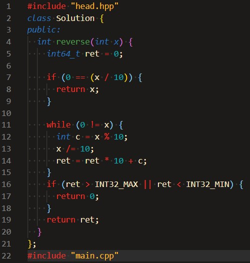
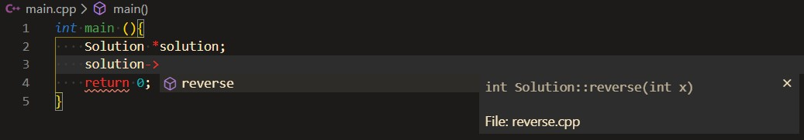
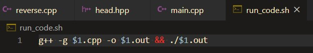

# VScode 个性化设置

因为我几乎所有文件编辑，代码书写都是在VScode中完成的。所以VScode的插件相对完备。

而且VScode用了惰性加载插件的功能，所以不用担心插件过多而启动慢的问题。而且其实写个`c/c++, python, shell, markdown`根本不用太多插件，极少数情况会写别的文件如`BNF，CmakeLists.txt，Racket`啥的需求不会那么频繁

我主要在WSl下工作，插件数目保持在10个左右。

主要推荐的就是

- TODO Highlight:TODO 高亮
- Bracket Pair Colorizer 2:括号匹配颜色会把当前光标所在作用域框起来
- Romote-WSL
- clang-Format：格式化代码，我使用的是Google风格

我不推荐用leetcode插件，最近面试我也开始刷题了，发现其实就是那么几个库要使用，你要实现的就是`Solution`类的函数。这个直接在本地配置就好了。

## 头文件

## class 主题部分

## 主函数

把VScode配置好。完全可以在main文件中看到自动补全提示.

## 编译

只要运行这个脚本即可运行。

## 为啥可以这么`include`的呢

因为g++在对include的时候其实是把代码对应的赋值粘贴过去，所以这么写是没有问题的。这样写就不用一直改头文件和`main.cpp`了。

其实如果c++有反射机制的话可以更加简便。我过一阵子会用c++去尝试实现一个反射机制。

## 代码格式

使用clang-Format前你要确保本地安装了clang-Format。

Ubuntu下：

~~~shell
sudo apt-get install clang-Format
~~~
