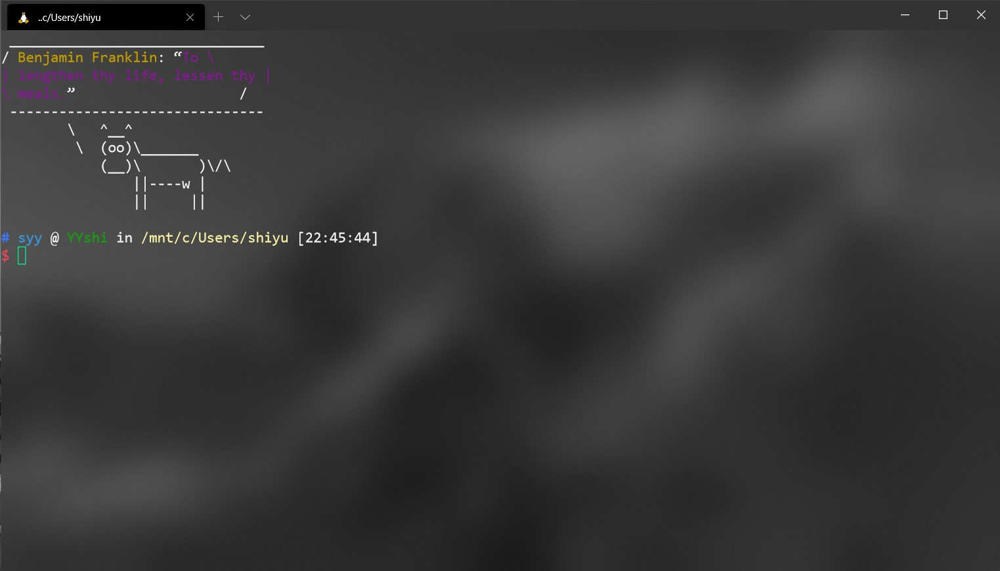

# 终端配置

## 最终结果

## 详解

有毛玻璃特效。神色背景

[我的配置文件](./my_setting.json)

### 第一部分快捷键设置

我主要痛的是Ubuntu，所以我把所有的快捷键改为对Ubuntu的操作。

### Ubuntu效果设置

- 246行：设置亚克力效果的*不透明度*，即越小越透明。
- 251行：为了终端下显示的好，把cursor bar设置为空盒的效果，这样能看到当前shell下光标所在的字符是什么
- 260行：`useAcrylic`设置为`true`就可以得到亚克力效果的terminal
