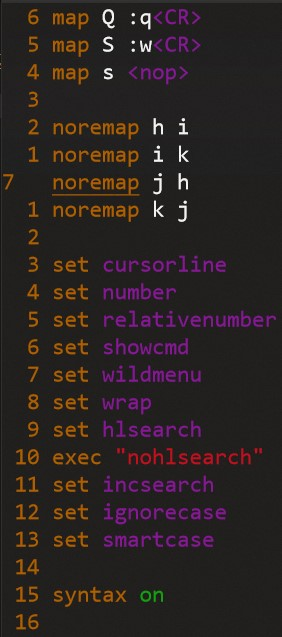

# Vim配置

## 键盘映射

- Vim的键位中Ctrl键是十分重要的。但是我们通用的键盘即QWER键盘中这个CTRL键位太尴尬了。用小拇指会抽筋，用手心有时会误触。
- Esc也是常用键位但是很远。

因此我再windows下写了一个注册表，把键位映射过来了。即Ctrl和大小写锁定键位互换，ESC键位和数字键中1左边的键位呼唤。我的注册表内容是：

~~~
Windows Registry Editor Version 5.00

[HKEY_LOCAL_MACHINE\SYSTEM\CurrentControlSet\Control\Keyboard Layout]
"Scancode Map"=hex:00,00,00,00,00,00,00,00,05,00,00,00,29,00,01,00,01,00,29,00,3A,00,1D,00,1D,00,3A,00,00,00,00,00

~~~

大家把这个文件保存为一个注册表文件，加入覆盖掉键盘的注册表即可使用。

## Vim配置文件

可以看到最后效果：

- 有绝对行数信息和相对位置信息，便于使用行跳转。
- 有语法高亮
- 做了快捷键映射，因为我写代码十分保守，没写几行就要`Ctrl-s`保存一下，写多了就`Git add + Git commit -m "tmp add"`这样保存一下，所以把vim下`Shift-S`改为保存修改，`Shift-Q`改为退出。这样不用每次`:w`、`:q`、`:wq`了

~~~vim
map Q :q<CR>
map S :w<CR>
map s <nop>

noremap h i
noremap i k
noremap j h
noremap k j

set cursorline
set number
set relativenumber
set showcmd
set wildmenu
set wrap
set hlsearch
exec "nohlsearch"
set incsearch
set ignorecase
set smartcase

syntax on
~~~
