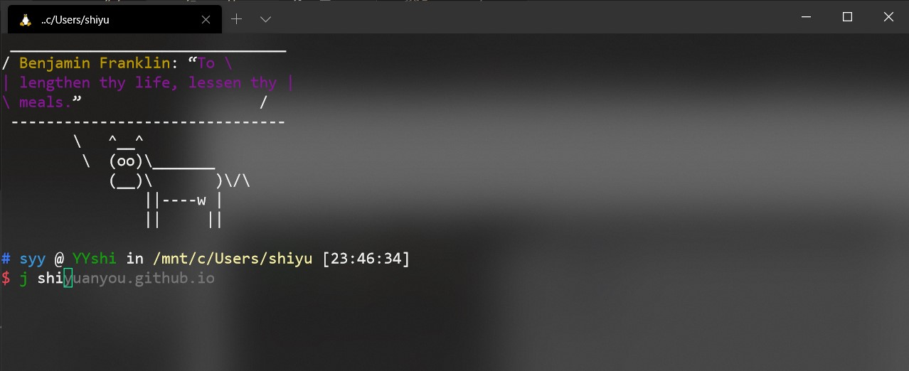
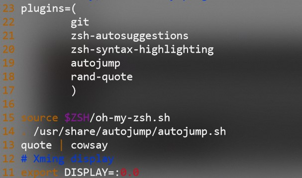
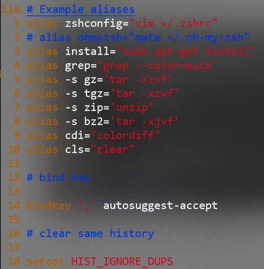

# Zsh配置

## 最终效果

可以看到语法高亮，自动提示。可以使用快捷键采纳这个提示。

## 安装

### 基础zsh

1. 安装zsh：
   `sudo apt-get install zsh`
2. 更改zsh为默认shell：
   `chsh -s $(which zsh)`

### 插件安装

<small>tip:[zsh插件GitHub](https://github.com/zsh-users)</small>

1. oh-my-zsh:
   `sh -c "$(wget -O- https://raw.githubusercontent.com/ohmyzsh/ohmyzsh/master/tools/install.sh)"`
2. zsh-autosuggestions:
   `git clone https://github.com/zsh-users/zsh-autosuggestions ${ZSH_CUSTOM:-~/.oh-my-zsh/custom}/plugins/zsh-autosuggestions`
   在`zshrc`中插件处添加`zsh-autosuggestions`
3. zsh-syntax-highlighting:
   `git clone https://github.com/zsh-users/zsh-syntax-highlighting.git`
   `echo "source ${(q-)PWD}/zsh-syntax-highlighting/zsh-syntax-highlighting.zsh" >> ${ZDOTDIR:-$HOME}/.zshrc`
   `source ./zsh-syntax-highlighting/zsh-syntax-highlighting.zsh`
4. autojump:
   `git clone git://github.com/wting/autojump.git`
   `cd autojump`
   `./install.py`
   在`.zshrc`中添加`autojump`插件.

## 配置

我的`~/.zshrc`[文件](./zshrc)

### 每次打开的名言

文件83行，`queto | cowbay`,需要安装`queto`和`cowbay`才能正常使用

### 一些常用插件

可以根据需求自行增加删除，只要下载插件之后在这里添加就可以

### 缩写和键位映射

可以看到我用install代替了`sudo apt-get install`如果不需要用sudo安装的时候才手动敲入

还有对压缩包的操作，如果键入压缩包的名称会自动识别解压到默认文件夹。

其实`clear`不用映射也可以因为`Ctrl-l`也可以清屏。

键位映射是用`,`来作为采纳建议的快捷键。
